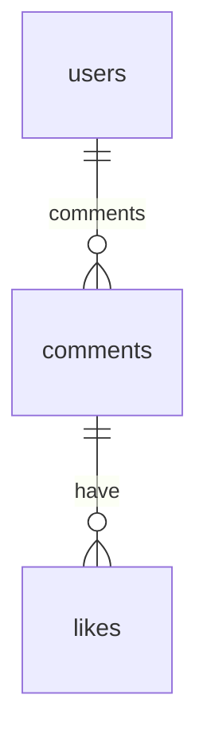

## API ENDPOINTS
### Profile
**Create Profile `POST /`**

**Get Profile `GET /:userId`**

### Comments
**Create a comment `POST /users/:userId/comments`**

**Get comments `GET /users/:userId/comments`**

**Like a comment `POST /comments/:commentId/likes`**

**Get likes from the comment `GET /comments/:commentId/likes`**

