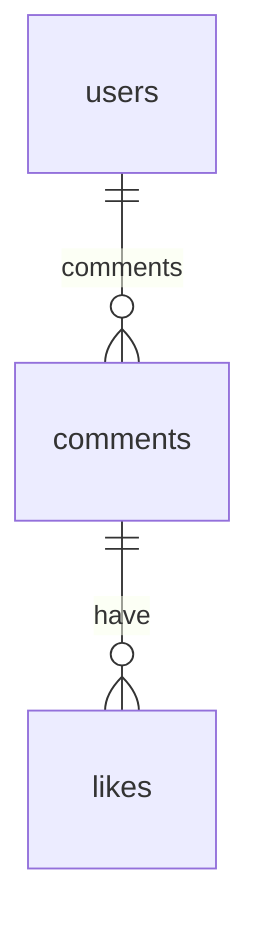

- [X] - Connect to mongo-memory-server
- [X] - Add node-dev for developer server
- [X] - Add ajv validator
- [X] - Add a validator
- [X] - Add integration test on Creat Profile
- [ ] - Add the following test cases
  - [ ] - Invalid Data
  - [ ] - Response when success
- [X] Add a `CommentModel`
  - [X] Have the following fields: `commentedTo`, `commentedBy`, `title`, `comment`, and , `personalitySystems`
  - [X] `personalitySystems` is a schema with the following fields: `mbti`, `enneagram`, and `zodiac`.
  - [X] add a virtual field `numberOfLikes`
- [X] Add a `LikeModel` with the following fields:
  - [X] `commentId`
  - [X] `likedBy`
- [X] - Add a router 
- [ ] Remove `_id` from the schema when querying
- [ ] Design the voting strategy and commenting
- [ ] Add liking to the comment
- [X] Add sort via timestamps 
- [X] Add sort via numberOfLikes
- [X] Add filtering of mbti, enneagram, and zodiac

